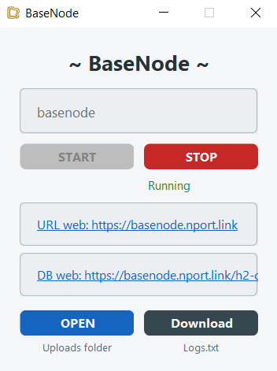
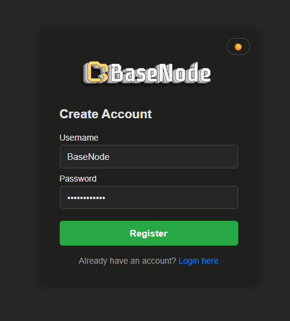
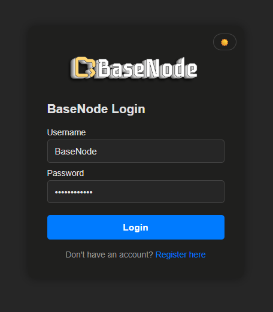
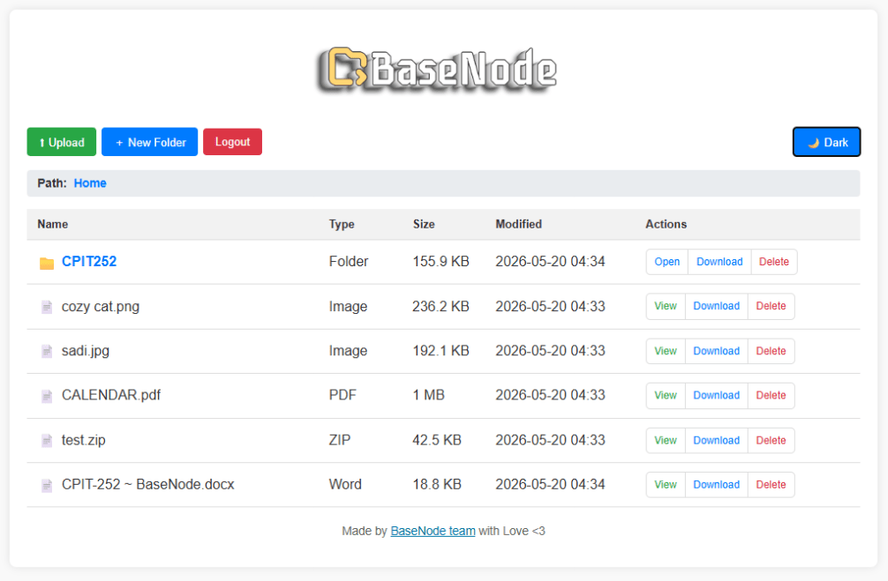
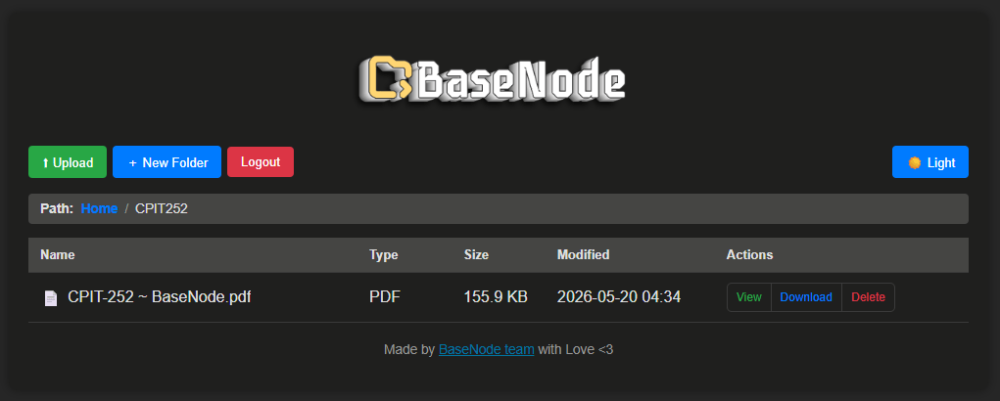

**A lightweight personal file server — access your files from any browser, anywhere.**


</div>

---

## What is BaseNode?

Most people have no simple, free way to access their home PC files remotely. Cloud storage costs money. Remote desktop is overkill. Network drives only work at home.

BaseNode solves this — install it on your PC, and access your files from any phone, laptop, or tablet through a browser. Your files stay on your machine. Private. Free. Simple.

---

## Features

- 📁 Browse, upload, download, and delete files and folders
- 🔄 Real-time sync — changes on disk appear instantly in the browser (no refresh needed)
- 🗂 Folder navigation with breadcrumb trail
- 📦 Download entire folders as `.zip`
- 🔐 Login and registration system with BCrypt password hashing
- 🛡 File type validation via Apache Tika — blocks spoofed or dangerous uploads
- 🚦 Login rate limiting — accounts are temporarily locked after 5 failed attempts
- 🌐 Remote access via NPort tunnel — share a public URL directly from the UI
- 📋 Audit logging — login, logout, registration, uploads, and deletes are all logged
- ⚠️ Upload size limit (default 500 MB) with friendly error notifications
- 🖥 Works from any browser on any device

---

## Tech Stack

| Layer | Technology |
|---|---|
| Language | Java 17 |
| Framework | Spring Boot 3.5 |
| Template Engine | Thymeleaf |
| Database | H2 (embedded, file-based) |
| ORM | Hibernate / Spring Data JPA |
| Security | Spring Security + BCrypt |
| File Validation | Apache Tika 3.2 |
| Real-time | Java WatchService + SSE (Server-Sent Events) |
| Remote Tunneling | NPort |
| Build Tool | Maven |
| Containerization | Docker |

---

## Getting Started

### Requirements

- Java 17 or higher
- Maven 3.6 or higher

### Run locally

```bash
# 1. Clone the repository
git clone https://github.com/Ahmed-Alsefari/BaseNode.git
cd BaseNode/BaseNode

# 2. Build the project
mvn clean install

# 3. Run it
mvn spring-boot:run
```

Then click to the URL link:

```
https://my-server.nport.link
```

### Run with Docker

```bash
# Build the image
docker build -t basenode ./BaseNode

# Run the container
docker run -p 8080:8080 basenode   
```

A pre-built image is also published to Docker Hub automatically on every push to `main`.

```bash
# Download the image
docker pull faisalaljuaid/basenode:latest

# Run the container
docker run --name basenode -p 8080:8080 faisalaljuaid/basenode:latest

```


---

## Configuration

All settings are in `BaseNode/src/main/resources/application.properties`.

```properties
# DB username and password 
spring.datasource.username=sa
spring.datasource.password=123

# Upload size limit (change to whatever suits your machine)
spring.servlet.multipart.max-file-size=500MB
spring.servlet.multipart.max-request-size=500MB
basenode.max-upload-size=500MB
```

> The `Uploads` folder is created automatically one level above the project directory on first run.

The H2 database is stored at `../basenode_db` relative to the run directory. You can access the H2 console at `/h2-console` (enabled by default).

---

## Project Structure

```
BaseNode/
├── src/main/java/com/BaseNode/BaseNode/
│   ├── composite/        # Composite pattern (file system tree)
│   ├── controller/       # Web + API controllers
│   ├── service/          # Business logic, file watcher, NPort, audit, validation
│   ├── model/            # JPA entities (File, Folder, User)
│   ├── repository/       # Spring Data repositories
│   ├── factory/          # EntityFactory (Factory pattern)
│   ├── observer/         # SSE observer for real-time updates
│   ├── request/          # Login and Register request DTOs
│   └── config/           # Security + storage config
├── src/main/resources/
│   ├── templates/        # Thymeleaf HTML pages (index, login, register)
│   ├── static/           # Images
│   └── application.properties
└── pom.xml
```


```
BaseNode/
├── src/main/java/com/BaseNode/BaseNode/
│   ├── composite/        # Composite pattern (file system tree)
│   ├── controller/       # Web + API controllers
│   ├── service/          # Business logic, file watcher, NPort, audit, validation
│   ├── model/            # JPA entities (File, Folder, User)
│   ├── repository/       # Spring Data repositories
│   ├── factory/          # EntityFactory (Factory pattern)
│   ├── observer/         # SSE observer for real-time updates
│   ├── request/          # Login and Register request DTOs
│   └── config/           # Security + storage config
├── src/main/resources/
│   ├── templates/        # Thymeleaf HTML pages (index, login, register)
│   ├── static/           # Images
│   └── application.properties
└── pom.xml
```


---

## Design Patterns Used

- **Factory Pattern** — `EntityFactory` centralizes object creation for files, folders, users, and requests
- **Proxy Pattern** — `SecureFileServiceProxy` wraps file service calls with session-based access control
- **Composite Pattern** — `FileSystemTree` builds a recursive tree of folders and files, allowing the total size of any folder to be calculated across all nested subfolders
- **Observer Pattern** — `SseObserver` implements real-time push notifications to the browser whenever the watched directory changes

---

## Security

- Strong password hashing using BCrypt
- Login rate limiting to reduce brute-force attempts
- Server-side MIME type validation using Apache Tika
- Session-based access control for protected endpoints
- Audit logging for security-relevant actions
- Upload size limits to reduce abuse
- H2 console should only be used in local development
- UUID-based file references to mitigate IDOR vulnerabilities


---

## Allowed Upload Types

| Category | Formats |
|---|---|
| Images | PNG, JPEG, GIF, WebP, SVG |
| Documents | PDF, TXT, RTF |
| Office (Modern) | DOCX, XLSX, PPTX |
| Office (Legacy) | DOC, XLS, PPT |
| Archives | ZIP, RAR, 7z |
| Data | JSON, CSV, XML |
| Audio / Video | MP3, WAV, MP4, MPEG |

---

## Remote Access (NPort)

NPort must be installed and available on `PATH` for this feature to work. The Docker image installs it automatically.
```
# install NodeJS
winget install OpenJS.NodeJS

# install Nport
npm i -g nport

# set up Nport
nport.exe               > select English 

```

## Screenshots


<p align="center">

</p>

<p align="center">

</p>
   
<p align="center">

</p>


<p align="center">

</p>

<p align="center">

</p>


## License

MIT — free to use, modify, and share.

---

<div align="center">
  Made by <a href="https://github.com/Ahmed-Alsefari/BaseNode">BaseNode team</a> with Love <3
</div>
